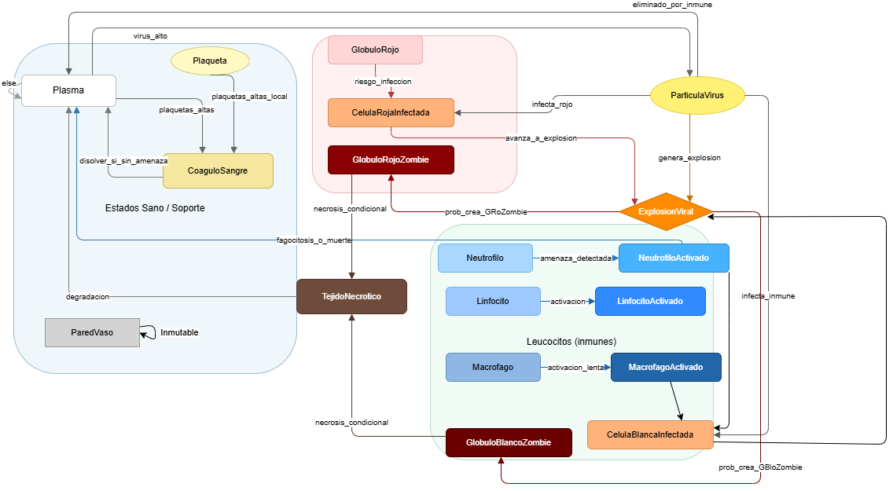

# Automata Celular: Comportamiento de Virus en el cuerpo humano

- El presente repositorio recopila variedad de archivos en relación con el proyecto final de la asignatura Autómatas y Lenguajes Formales dictada por el docente Luis Guayacán en 2025-2

- La anterior imagen es el diagrama de estados de nuestra autómata celular
